# Clinic Management System (Java + JavaFX)

## 📌 Project Overview

The Clinic Management System is a desktop application built using Java and JavaFX. It allows users to manage patients, doctors, and appointments efficiently through a graphical user interface.

The system supports:

* Adding and managing patients
* Booking, rescheduling, and canceling appointments
* Viewing appointment history per patient
* Displaying doctor schedules
* Persistent storage using CSV files

---

## 🧠 Features

### 👤 Patient Management

* Add new patients
* Store patient details (ID, name, age, contact)
* View patient visit history

### 📅 Appointment System

* Book appointments with doctors
* Prevent double booking
* Cancel appointments
* Reschedule appointments
* Filter appointments by status

### 🩺 Doctor Management

* Predefined list of doctors
* Specialty-based categorization
* View doctor schedules

### 💾 File Storage

* Patients stored in `patients.csv`
* Appointments stored in `appointments.csv`
* Automatic save/load on system startup

---

## 🏗️ Project Structure

```
Clinic-System/
│
├── ClinicApp.java          (JavaFX UI)
├── ClinicSystem.java       (Core logic)
├── Patient.java            (Patient model)
├── Doctor.java             (Doctor model)
├── Appointment.java        (Appointment model)
├── FileManager.java        (File handling)
│
├── patients.csv            (Data storage)
├── appointments.csv        (Data storage)
│
└── README.md
```

---

## 🧩 UML Class Diagram

```mermaid
classDiagram

class ClinicApp {
    +start(Stage stage)
}

class ClinicSystem {
    -ArrayList patients
    -ArrayList doctors
    -ArrayList allAppointments
    +addPatient()
    +bookAppointment()
    +cancelAppointment()
    +rescheduleAppointment()
}

class Patient {
    -int id
    -String name
    -int age
    -String contactInfo
    -ArrayList visitHistory
    +addVisit()
    +printVisitHistory()
}

class Doctor {
    -String name
    -String specialty
    -ArrayList appointments
    +addAppointment()
    +isBusy()
}

class Appointment {
    -int appointmentId
    -int patientId
    -String patientName
    -Doctor doctor
    -String dateTime
    -String status
}

class FileManager {
    +savePatients()
    +loadPatients()
    +saveAppointments()
    +loadAppointments()
}

ClinicApp --> ClinicSystem
ClinicSystem --> Patient
ClinicSystem --> Doctor
ClinicSystem --> Appointment
FileManager --> Patient
FileManager --> Appointment
Doctor --> Appointment
Patient --> Appointment
```



---

## ⚙️ How to Run the Project

### 1. Compile

```bash
javac --module-path "C:\FX SDK\javafx-sdk-26.0.1\lib" --add-modules javafx.controls,javafx.fxml -d out *.java
```

### 2. Run

```bash
java --module-path "C:\FX SDK\javafx-sdk-26.0.1\lib" --add-modules javafx.controls,javafx.fxml -cp out ClinicApp
```

---

## 📊 System Design Summary

The system follows an **MVC-inspired structure**:

* **Model**: Patient, Doctor, Appointment
* **Controller**: ClinicSystem
* **View**: ClinicApp (JavaFX UI)

This separation improves maintainability and scalability.

---

## 🚀 Future Improvements

* Database integration (MySQL instead of CSV)
* Login system (Admin / Receptionist roles)
* Online booking support
* Analytics dashboard (busy doctors, peak hours)

---

## 👨‍💻 Authors

Hamza Ahmed , Hamad Amer , Habiba Tarek , Mohamed Ahmed , Zyad Ahmed

Computer Science Students @ NU
